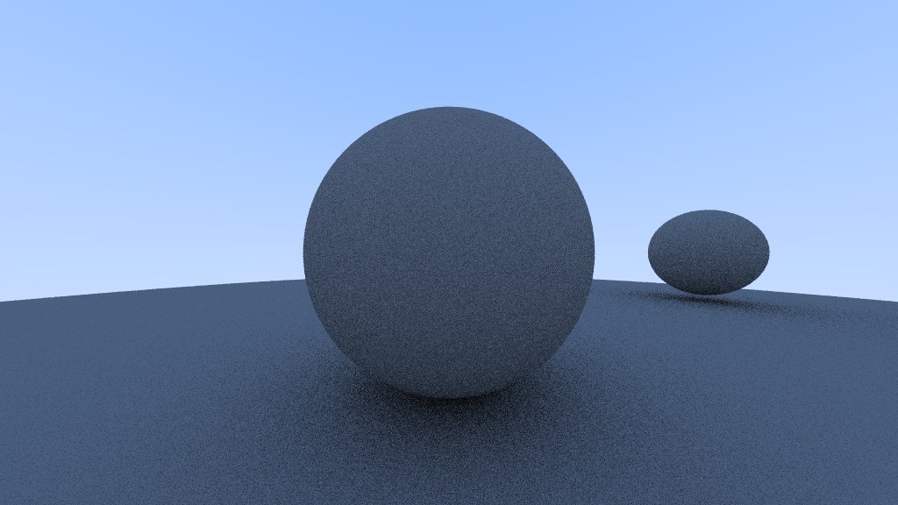
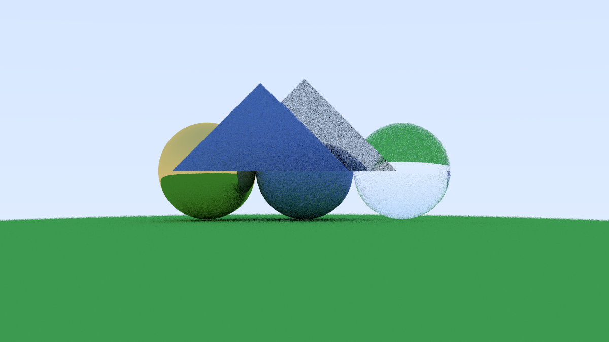
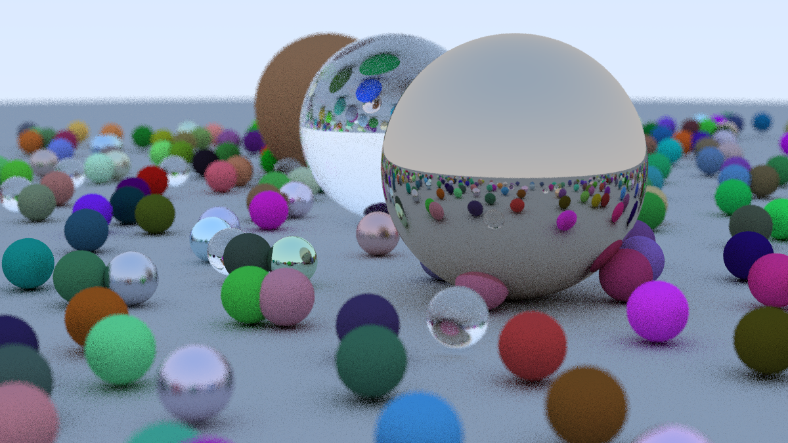

# Luminara-Raytracing

## Overview

Luminara-Raytracing is a basic ray tracing system implemented in C++ and CUDA following the book [Ray Tracing in One Weekend](https://raytracing.github.io/books/RayTracingInOneWeekend.html). It renders simple scenes composed of spheres and triangles with different materials, demonstrating fundamental ray tracing techniques including geometry intersection, material shading, and GPU acceleration.

---

## Project Structure

### Main Files

* **`main.cpp` / `main.cu`**
  Entry points that set up the scene, camera, and perform ray tracing to compute the final image pixels.

### Utilities (`utils/`)

* **`utils.h`**, **`types.h`**, **`logs.h`**
  Helper functions and macros for math operations, random number generation, and logging.

### Window Management (`Window/`)

* Implements GLFW-based window creation and OpenGL-based texture rendering to display ray traced images in real-time.

### Geometry (`raytracing/geometry/`)

* **`vec3.h`**: 3D vector class with associated operations.
* **`ray.h`**: Ray class representing rays in 3D space.

### Scene Objects (`raytracing/objects/`)

* **`hittable.h`**: Abstract base for scene objects that rays can intersect.
* **`triangle.h`**: Triangle class inheriting from hittable, using the Möller-Trumbore intersection algorithm.
* **`sphere.h`**: Sphere class inheriting from hittable, with standard sphere intersection logic.

### Materials (`materials.h`)

Defines material models that describe how rays interact with surfaces:

* **`material.h`**: Abstract base class defining a virtual `scatter` method.
* **`lambertian`**: Diffuse material scattering light uniformly.
* **`metal`**: Reflective metallic surface.
* **`dielectric`**: Transparent dielectric material (e.g., glass) with Fresnel reflection/refraction.

### Camera (`camera.h`)

Defines the `Camera` class, responsible for setting camera position, orientation, field of view, and generating rays for each pixel.

### Worlds (`worlds.h`, `worlds_cuda.cu`)

Scene definitions including object placement and material assignment. Includes predefined scenes:

* `simple_world`
* `book_cover_world`

---

## How It Works

1. **Scene Initialization**
   Objects (spheres and triangles) are instantiated with their geometry, position, size, and material properties.

2. **Ray Tracing**
   Rays are cast from the camera through each pixel. Each ray is tested for intersections with scene objects.

3. **Lighting Calculation**
   Upon intersection, rays interact with materials, which scatter, reflect, or refract them according to their type, determining pixel colors based on light transport.

4. **Accumulation and Display**
   Color results are accumulated per pixel to build the final rendered image, displayed via OpenGL or saved to disk.

---

## Build & Run Instructions

Use the included `Makefile` to build and execute the project:

* glfw build:

  ```bash
  make glfw
  ```

* CPU version:

  ```bash
  make render
  ```

* GPU version with CUDA:

  ```bash
  make render_cuda
  ```

* Profiling GPU version:

  ```bash
  make profile_render_cuda
  ```

---

## Gallery








